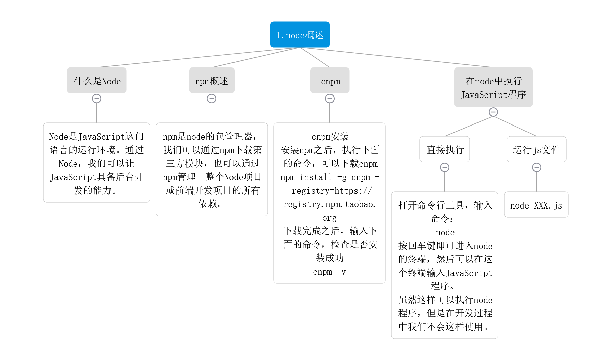
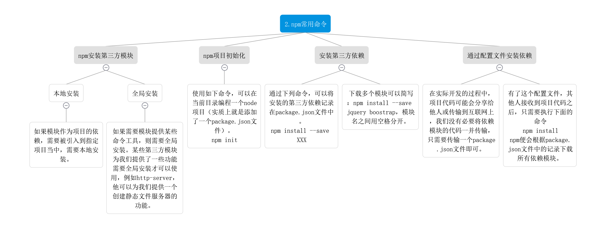
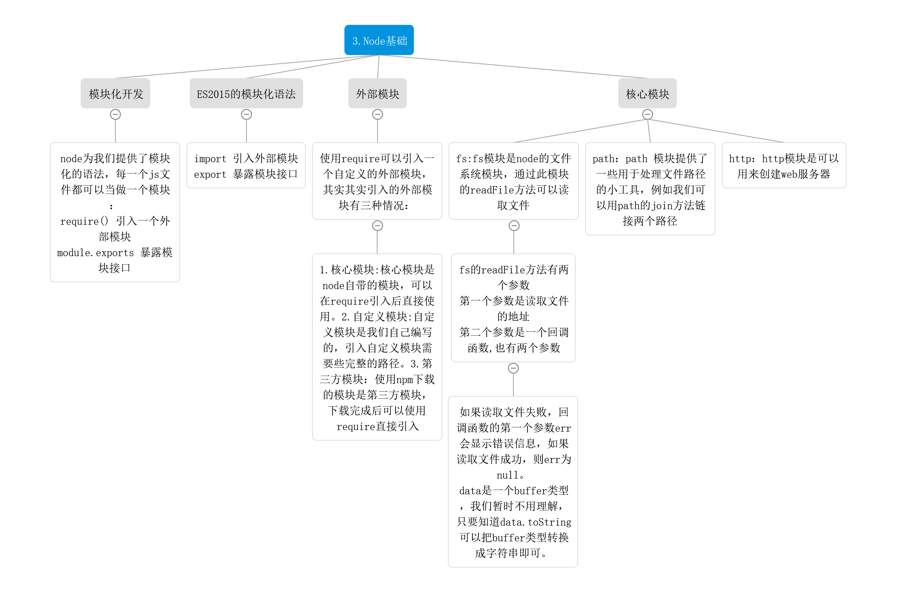
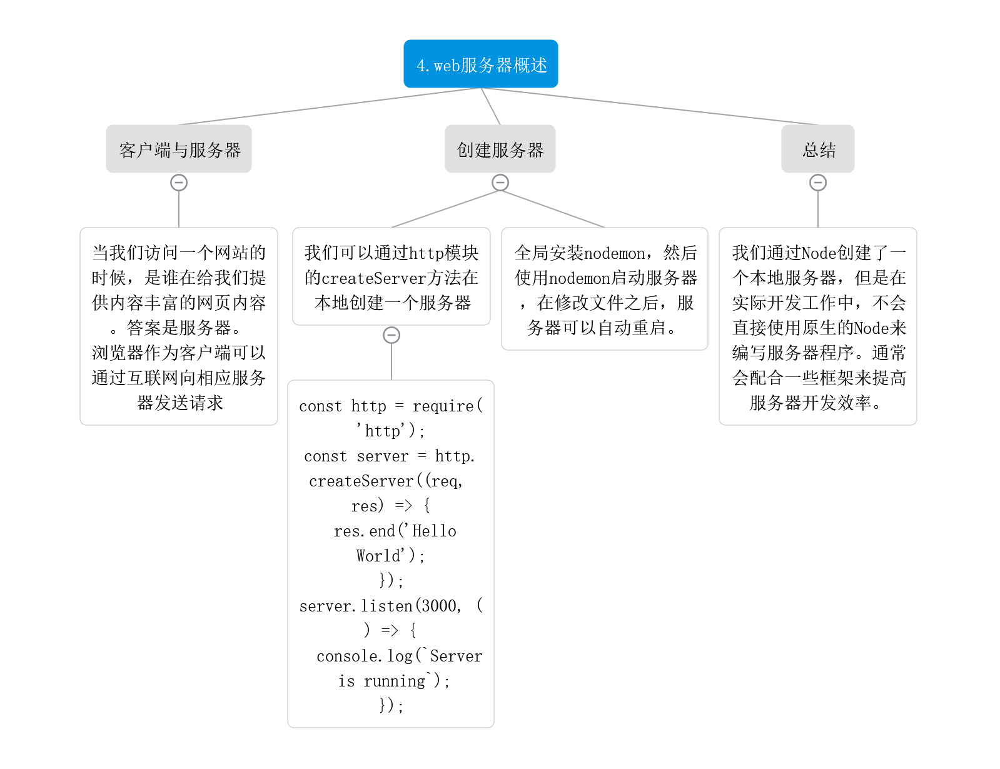
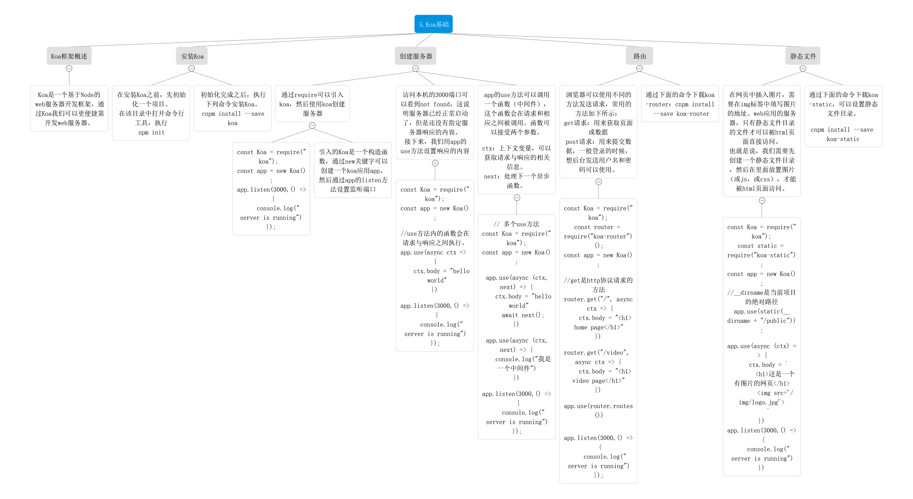
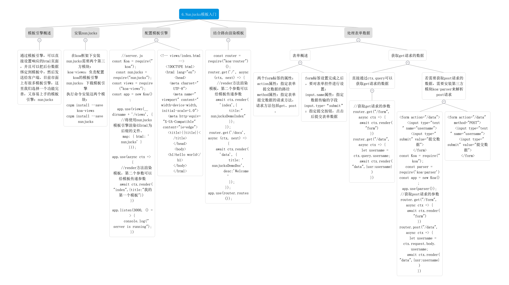
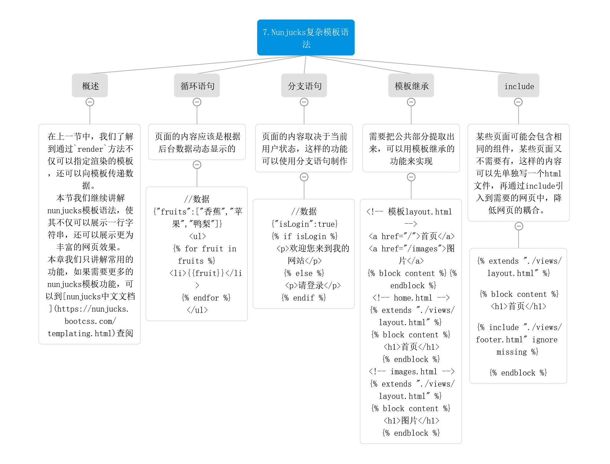
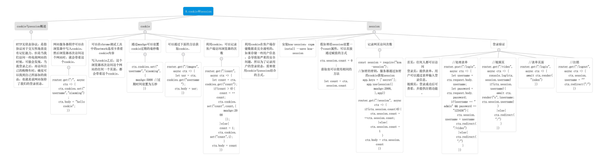

# Nodejs learning router
1.node概述  
源码：./Basic/hello.js  
  
2.npm常用命令  
  
3.Node基础  
源码：./Basic/fsDemo.js  
  ./Basic/pathDemo.js  
  ./Basic/calculate.js  
  ./Basic/calcRes.js
  
4.web服务器概述  
源码：  ./Basic/httpDemo.js  
  
5.Koa基础  
源码：./Koa/koaRouterDemo.js  
./Koa/koaStaticDemo.js  
./Koa/koaDemo.js  
  
6.Nunjucks模板入门  
源码：./Koa/nunjucksDemo.js  
./Koa.formDemo.js  
  
7.Nunjucks复杂模板语法  
源码：./Koa/nunjucksTemplate.js  
  
8.cookie和session  
源码：./Koa/CookieAndSession.js  
  

注：./Koa/VueServer.js在学Vue的axios时需要用到